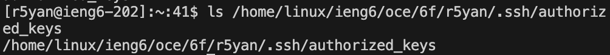
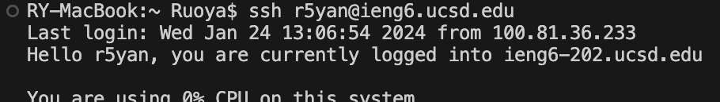

# Lab Report 2
## Part 1
```
// NOTE: Copied and edited from NumberServer.java, as provided from wavelet
import java.io.IOException;
import java.net.URI;

class MyHandler implements URLHandler {
    String chatLog = "";

    public String handleRequest(URI url) {
        String path = url.getPath();
        if (path.equals("/add-message")) {
            String query = url.getQuery();
            String s = query.split("&")[0].substring("s=".length());
            String user = query.split("&user=")[1];
            chatLog += user + ": " + s + "\n";
            return chatLog;
        } else {
            return "404 Not Found!";
        }
    }
}
class ChatServer {
    public static void main(String[] args) throws IOException {
        if(args.length == 0){
            System.out.println("Missing port number! Try any number between 1024 to 49151");
            return;
        }

        int port = Integer.parseInt(args[0]);

        Server.start(port, new MyHandler());
    }
}

```

* The `handleRequest` method was called (not the `main` method, which is only called when we start the server).
* The `url` argument was a `URI` object, such that `url.getPath()` would return `/add-message` and `url.getQuery()` would return `s=hi guys&user=bob`. The `chatLog` field had the value of an empty String.
* After the string manipulation, the `chatLog` field changed to the value `bob: hi guys\n`.

* The `handleRequest` method was called.
* The `url` argument was a `URI` object, such that `url.getPath()` would return `/add-message` and `url.getQuery()` would return `s=sup&user=guys`. The `chatLog` field had the value of `bob: hi guys\n`.
* After the string manipulation, the `chatLog` field changed to the value `bob: hi guys\nguys: sup\n`.
## Part 2



## Part 3
From the `man` page of `mkdir`, I have discovered the `-p` option that allows you to create a nested sequence of directories by filling in the ones that do not exist yet. At first, I tested this with `mkdir delete/me -p`, and then I learned two things at once.
 1. Options must go before the operands.
 2. `mkdir` can create multiple directories at once, even if the an earlier one errors, or the directory name starts with an hyphen.
