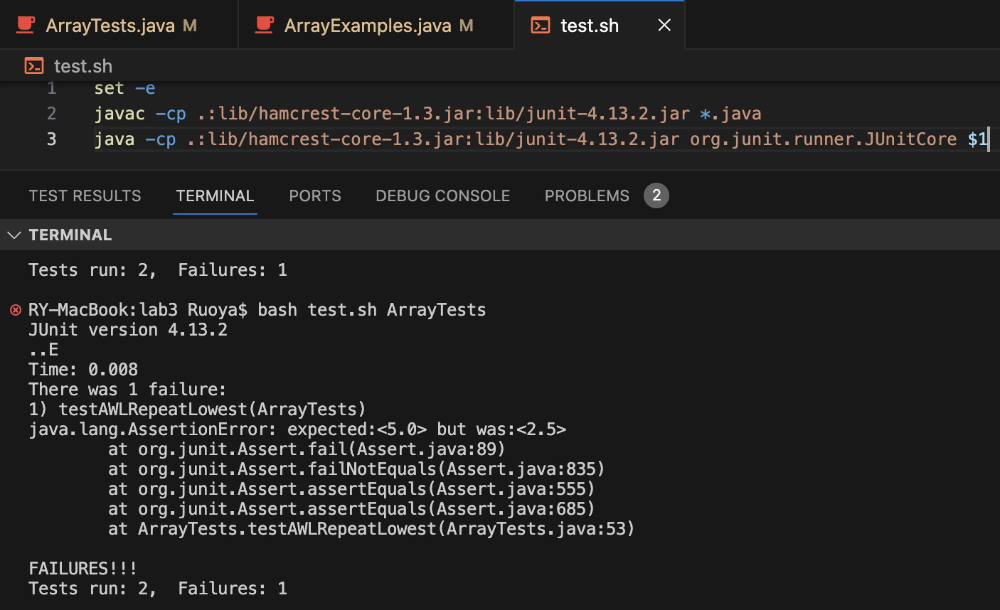

# Lab Report 3
## Part 1 - Bugs
### Failure-Inducing Input
```
@Test
public void testAWLRepeatLowest() {
  double[] arr = {1.0, 1.0, 5.0};
  assertEquals(3.0, ArrayExamples.averageWithoutLowest(arr), 0.0001);
}
```
### Input with No Failure
```
@Test
public void testAWL() {
  double[] arr = {-3, -100, 3, -9};
  assertEquals(-3.0, ArrayExamples.averageWithoutLowest(arr), 0.0001);
}
```
### The Symptom

### The Bug
#### Before:
```
static double averageWithoutLowest(double[] arr) {
  if(arr.length < 2) { return 0.0; }
  double lowest = arr[0];
  for(double num: arr) {
    if(num < lowest) { lowest = num; }
  }
  double sum = 0;
  for(double num: arr) {
    if(num != lowest) { sum += num; }
  }
  return sum / (arr.length - 1);
}
```
#### After:
```
static double averageWithoutLowest(double[] arr) {
  if(arr.length < 2) { return 0.0; }
  double lowest = arr[0];
  for(double num: arr) {
    if(num < lowest) { lowest = num; }
  }
  double sum = 0;
  for(double num: arr) {
    sum += num;
  }
  sum -= lowest;
  return sum / (arr.length - 1);
}
```
### Explanation
The code use to skip every instance of a value equal to the lowest value. Now, it includes every instances, but undoes one of them by subtraction.

## Part 2 - Researching Commands
I choose the `grep` command. All options and their effects were found using `man grep`.
### `-color`
```
RY-MacBook:technical Ruoya$ grep --color=always "bioluminescence" biomed/*
biomed/1471-2202-3-1.txt:          correspond to the intensity of bioluminescence sampled
biomed/1471-2202-3-1.txt:          activity counts against counts of bioluminescence.
biomed/1471-2202-3-1.txt:          bioluminescence over time). Figure 8bshows these same
biomed/1471-2202-3-5.txt:          bioluminescence. As noted above, the mean vectors
```
Of course, the code block does not do it justice, so it is as a screenshot:


This command outputs each line that contains `bioluminescence` of each file directly in the biomed folder (along with the file's relative path), 
and colors the word red, which is apparently the value stored in my GREP_COLOR. This may help
lead the eyes immediately to their context within (potentially long) lines.
```
RY-MacBook:technical Ruoya$ grep --color=always "  m" biomed/rr37.txt
          month). These exclusions had no significant effect on
          medical provider for asthma care at baseline interview.
          majority of subjects indicated white, non-Hispanic
          medication, were also associated with a greater risk of
          multivariate analysis dividing the overall
          more strongly related to a greater risk of
          meaningful impact on the results in all multivariate
        may be less adequate among low income persons. Haas 
        mortality from asthma among Hispanic adults [ 40, 41, 42].
        may explain these variable results.
        maintenance organization members with asthma, systemic
        morbidity have provided mixed results [ 46, 47]. In the
        more broadly applicable.
        model. Although we were able to simultaneously consider
          mid-increment value was applied (except for the highest
          mental dimensions of health, respectively. Each summary
```
Screenshot:


This command outputs each line that contains `  m` in the rr37.txt file of biomed, 
and colors the letter m red (because the whitespace is still invisible). It helpfully indicates
which m's have the correct number of spaces before it, and which m's do not.


### `-h`
```
RY-MacBook:technical Ruoya$ grep -h "696" biomed/*
          water. This DNA was then used to transform TE696 ( 
          ESTs AI560960 and AI369608 were identical and contained 
          (Accession No. X96967) differs from the human sequence by
          containing 669 and 696 residues, respectively, in which
          YOL083w (XI, 442975-85) and YNL253w (XIV, 169669). BAGEL
          AF145686-AF145696, AF160929,
```
This command outputs each line that contains `696` of each file directly in the biomed folder,
but WITHOUT showing which file it came from. This cleaner output may help if you want to programmatically process it.
```
RY-MacBook:technical Ruoya$ grep -h "69" biomed/rr37.txt
          Physicians registered 669 eligible patients. After
          n = 669) are not available.
```
This command outputs each line that contains `69` in the rr37.txt file of biomed,
without showing the file it's from, as usual. We note this is behavior is consistent with 1 file vs
multi-file inputs, so it's easier to program with.

### `-c`
```
RY-MacBook:technical Ruoya$ grep -c "69" biomed/rr37.txt
2
```
This command outputs the number of lines that contain "69" in the rr37.txt file of biomed.
This is helpful for determining the frequency-by-line of specific words or phrases.
```
RY-MacBook:technical Ruoya$ grep -c "" biomed/rr37.txt
574
```
Since every line satisfying the empty string pattern, this command outputs the number of lines
in the rr37.txt file of biomed. This can allow us to double check our line counts from more standard
methods, like `wc`.
### `-v`
```
RY-MacBook:technical Ruoya$ grep -v -c " " biomed/rr37.txt
1
```
This command outputs the number of lines in the rr37.txt file of biomed that contains no spaces. A
non-zero output is a necessary (but not sufficient) condition for files that end in a newline, 
as is standard practice.
```
RY-MacBook:technical Ruoya$ grep -v "e" biomed/rr37.txt | grep "a"
        risk of hospitalization for asthma [ 2, 4, 5, 6, 7, 8, 9,
          n = 601) and 18-month follow-up
          P < 0.001 and 
          Hospitalization for asthma
          hospitalization for asthma.
          prior history of intubation.
          Statistical analysis
          Clinical risk factors for hospitalization:
          asthma hospitalization.
          analysis
          admission (OR, 2.0; 95% CI, 0.4-10.9).
          hospitalization for asthma.
          hospitalization for asthma (OR, 1.2; 95% CI, 1.02-1.4).
        of hospitalization.
        mortality from asthma among Hispanic adults [ 40, 41, 42].
```
This command outputs the lines of the rr37.txt file of biomed that feature the letter a, but not
the letter e. Using pipes to chain two `grep`s like this allows us to more easily filter out the
noise from the data.

